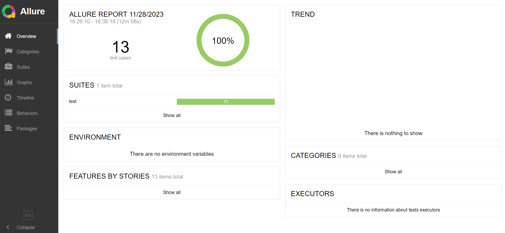

# About OrangeHRM
OrangeHRM Automation Framework is an open-source solution designed for Human Resource Management (HRM) tasks.

# Test Cases:

1. Login as an administrator with valid credentials.
2. Login as an administrator with invalid credentials.
3. Create an employee.
4. Create an employee without username.
5. Search for an employee by ID.
6. Update employee's ID.
7. Logout as the administrator.
8. Login using the valid credentials of the created employee.
9. Insert the employee's Gender,Marital Status, Blood, Address and email.

# Scenarios:
1. Login to orange hrm demo site: https://opensource-demo.orangehrmlive.com/
2. Create an employees and save it to csv file
3. Now go to PIM dashboard and search by user's ID. Assert that the user is found.
4. Now click on the user from the search table and update id by random userid
5. Now again search the user by new user id from the PIM dashboard menu and assert that the user is found
6. Now logout from admin and login with the employee's valid credentials
7. Now click on My Info menu
8. Select marital status, Gender and Blood Type and save it
9. Click on contact details and input city, zip code and email
10. Logout the user

### Allure Report:

  

### Technology used:
- Selenium Webdriver 
- Python
- Pytest
- Allure